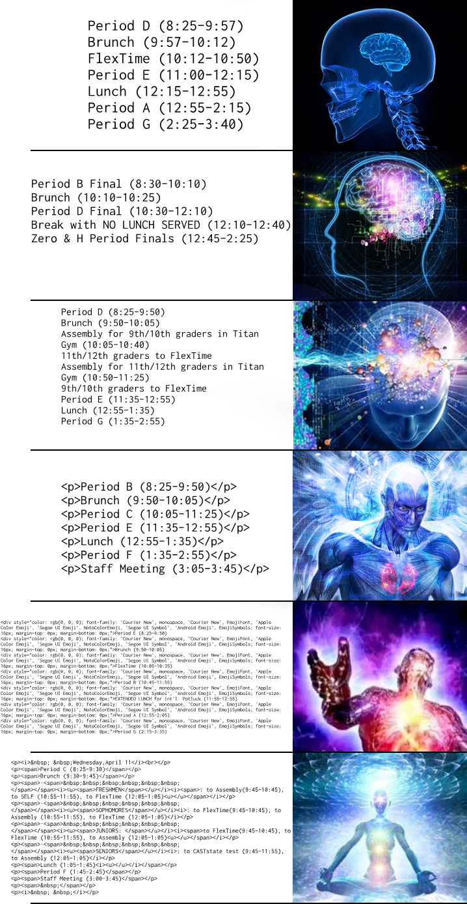

# alternate schedule parser tester
Tests your Gunn alternate schedule parser of the plain text descriptions of Gunn's Google Calendar alternate schedule events.

You'd think that your parser is UNDEFEATABLE, but suddenly Gunn releases a NEW alternate schedule with a NEW FORMAT that breaks your alternate schedule parser.

Although no parser is Gunn-proof, you can at least prepare for the ones that have already been pre-planned.
